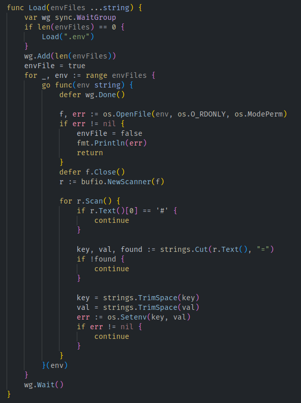

## Getting Started

Enable extended syntax highlighting

```JSON
    "gopls": {

        "ui.semanticTokens": true
    },
```

## Features

- highlighting namespace package
- highlighting comment
- highlighting err variable
